# Análise de preços e identificação de valores potencialmente atípicos no Banco de Preços em Saúde
_**Por:** Cristiane Ceia | **Em:** Setembro/2026_  

Este projeto corresponde ao MVP (_Minimum Viable Product_ ou Produto Mínimo Viável) para obtenção de especialização em Engenharia de Dados pela PUC-Rio, no curso de Pós-Graduação _Lato Sensu_ em Ciência de Dados e _Analytics_.  

O objetivo do MVP é a construção de um _pipeline_ de dados funcional e armazenado em ambiente nuvem, partindo de um problema com perguntas definidas, passando pelas etapas de coleta, carga, transformação e modelagem dos dados, até a etapa de análise de dados e de conclusão a partir dos resultados obtidos.  

O MVP foi elaborado no [Databricks Free Edition](https://www.databricks.com/learn/free-edition), conectado ao [GitHub](https://github.com/).

Este arquivo explicativo está estruturado da seguinte forma:  
1. **Contexto de Negócios e Perguntas**: apresenta o contexto do Banco de Preços em Saúde, o objetivo do MVP e as perguntas de negócio que orientam o desenvolvimento do projeto.  
2. **Origem dos Dados**: descreve a fonte dos dados, os arquivos utilizados, o processo de coleta e as informações relacionadas à disponibilidade e ao uso dos dados.  
3. ***Pipeline* de Dados**: apresenta a construção do _pipeline_ em arquitetura de camadas _bronze_, _silver_ e _gold_, incluindo as etapas de carga, tratamento, validação da qualidade, modelagem dimensional e preparação das estruturas analíticas.  
4. **Análise dos Dados**: apresenta as análises realizadas na camada _gold_ e os resultados obtidos para responder às perguntas de negócio definidas no MVP.  
5. **Autoavaliação**: apresenta uma reflexão sobre o alcance dos objetivos do MVP, as principais dificuldades e aprendizados durante sua execução e as possibilidades de evolução do projeto.  
6. **Referências**: reúne as fontes utilizadas para a obtenção e compreensão dos dados, bem como referências relacionadas às abordagens utilizadas no projeto.  

## Contexto de Negócios e Perguntas
---  
O Banco de Preços em Saúde (BPS) é uma plataforma gerida pelo Ministério da Saúde para registrar informações sobre compras de medicamentos e dispositivos médicos realizadas por instituições públicas e privadas. A base do BPS está disponível no [Portal de Dados Abertos do SUS](https://dadosabertos.saude.gov.br/dataset/bps) e contém informações sobre os itens adquiridos, preços, quantidades, instituições compradoras, fornecedores e características das compras, além do Código BR, também conhecido como CATMAT, utilizado para padronizar e identificar os itens e facilitar a comparação de preços.  

A disponibilidade dessas informações permite explorar como os preços registrados para um mesmo item variam entre diferentes compras e ao longo do tempo. Essa análise é relevante porque a comparação de preços depende de uma identificação padronizada dos itens e de dados organizados de forma que diferentes registros possam ser analisados em conjunto.  

Neste projeto, utilizamos os dados do BPS referentes aos anos de 2024, 2025 e 2026, disponibilizados no formato de arquivo CSV. O objetivo é construir um _pipeline_ de dados capaz de transformar os arquivos brutos em uma estrutura organizada e adequada para análise, permitindo investigar a evolução dos preços, a dispersão entre compras e a identificação de registros com comportamento potencialmente atípico.  

A análise de registros potencialmente atípicos é utilizada como mecanismo de exploração dos dados. Um registro identificado como potencialmente atípico não representa, por si só, um erro ou uma irregularidade na compra; trata-se de uma observação que apresenta um preço significativamente diferente dos demais registros do mesmo CATMAT segundo o critério estatístico adotado no MVP.  

### Perguntas de negócio

A partir desse contexto, o MVP buscou responder às seguintes perguntas:  

1. Como evoluíram os preços unitários registrados no BPS entre 2024 e 2026?  
2. Quais itens (CATMATs) apresentam maior dispersão de preços no período?  
3. Quais compras apresentam preços potencialmente atípicos em relação às demais compras do mesmo CATMAT?  
4. Como os registros potencialmente atípicos em relação às demais compras do mesmo CATMAT se distribuem:  
   4a. ao longo do tempo, por ano;  
   4b. por tipo de compra;  
   4c. por modalidade de compra;  
   4d. por fornecedor, entre aqueles com volume financeiro relevante? 

Essas perguntas orientaram as etapas do _pipeline_, desde a seleção e preparação dos dados até a modelagem e as análises realizadas na camada final. Dessa forma, a estrutura de dados está diretamente relacionada às necessidades de análise definidas para o problema.  

## Origem dos Dados  
---  
Os dados foram coletados manualmente no [Portal de Dados Abertos do SUS](https://dadosabertos.saude.gov.br), na página do conjunto de dados [Banco de Preços em Saúde - BPS](https://dadosabertos.saude.gov.br/dataset/bps), onde são disponibilizados os dados em formatos de arquivo CSV, JSON e XML, bem como o link para acesso via API, e o dicionário de dados e metadados.  

Neste MVP, foram considerados os arquivos em formato CSV referentes ao BPS dos anos 2024, 2025 e 2026, como base de dados; e o dicionário de dados e metadados em formato PDF, como fonte de informações gerais sobre os dados. Todos estes arquivos datam de 20/09/2026. Por esta razão, é importante mencionar que atualizações podem ser identificadas diretamente na fonte dos dados posteriormente e que o arquivo referente ao ano 2026 apresenta compras realizadas até o dia 17/09/2026.  

Os arquivos originais supracitados estão disponíveis na pasta [_arquivos originais](https://github.com/crisceia/mvp-puc-engenhariadedados/tree/main/_arquivos%20originais). 

**Licença de uso dos dados**: A página do conjunto de dados BPS não informa atualmente uma licença de uso específica destes dados. Entretanto, o Portal de Dados Abertos do SUS (onde ela está contida) possui uma [Cartilha de Dados Abertos](https://dadosabertos.saude.gov.br/Cartilha-de-Dados-Abertos-do-SUS_ISBN.pdf), na qual consta a permissão irrestrita de reuso das bases de dados publicadas em formato aberto. _Seção "Princípios e diretrizes da política de Dados Abertos", pág. 11, item 4_.  

## _Pipeline_ de Dados  
---  
Para a construção do _pipeline_ do dados, foi considerada a Arquitetura Medalhão, isto é, o padrão de organização em camadas adotado pelo Databricks, onde cada camada contém:  
- Camada _bronze_: o dado bruto salvo no ambiente nuvem, em _Delta Tables_.  
- Camada _silver_: o dado tratado e padronizado.  
- Camada _gold_: o dado na modelagem final disponível para as análises de negócio.

Estas camadas estão representadas no Databricks pelos esquemas _bronze_, _silver_ e _gold_, criados via interface dentro do catálogo `mvp_puc_engenhariadedados`, conforme demonstrado na imagem abaixo.  

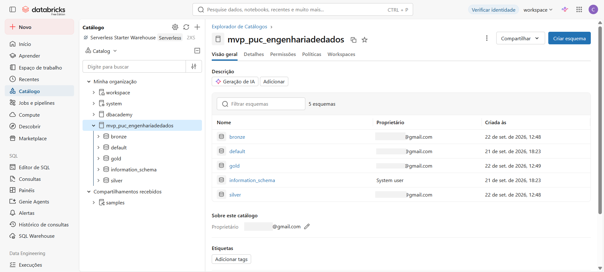

A seguir, apresentamos as atividades realizadas em cada uma das camadas supracitadas.  

### Camada _bronze_  

Na camada _bronze_, foi realizada a carga inicial dos dados brutos para as _Delta Tables_, via interface "Catálogo" > catálogo `mvp_puc_engenhariadedados` > opção "Criar" > "Tabela". Assim, foram criadas as tabelas `bps_2024`, `bps_2025` e `bps_2026` correspondentes ao arquivos originais em formato CSV .  

Dentro do "Catálogo", na aba "Detalhes", foi possível observar que a quantidade total de registros em cada uma das tabelas na camada _bronze_ corresponde ao número de registros nos arquivos originais em formato CSV. Também foi verificado, através da aba "Visão geral", que a estrutura e o tipo dos dados são os mesmos nas três tabelas. Portanto, as tabelas para o período de referência (2024 a 2026) foram unificadas para a etapa de tratamento dos dados, conforme seção a seguir.  

Abaixo, seguem evidências das tabelas criadas na camada _bronze_, bem como amostra do catálogo de dados da tabela `bps_2024`. Para visualização completa do catálogo de dados desta tabela e das demais tabelas da camada _bronze_, consultar o _notebook_ "[_05_Anexos_Catálogo de Dados](https://github.com/crisceia/mvp-puc-engenhariadedados/blob/main/Scripts%20e%20Resultados/_05_Anexos_Cat%C3%A1logo%20de%20Dados.ipynb)".  

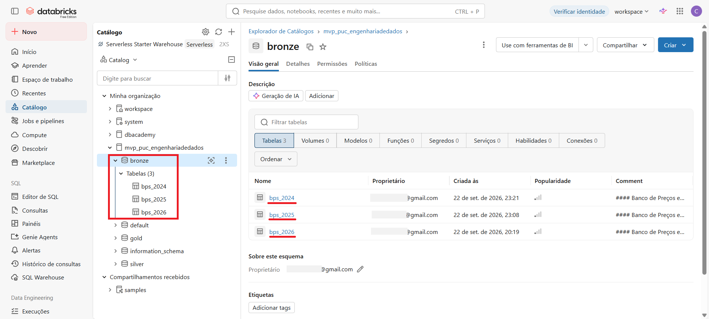  

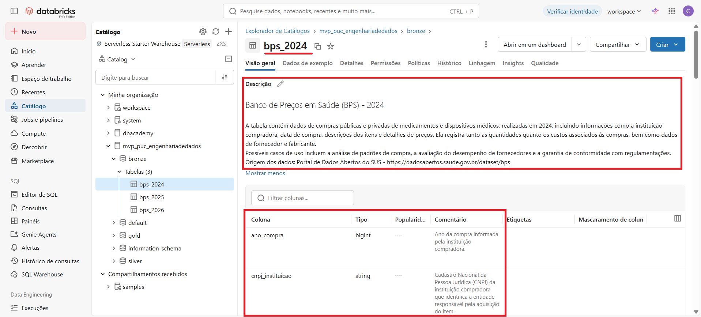

### Camada _silver_  

Na camada _silver_, foi realizada a unificação das três tabelas da camada _bronze_ para a tabela `bps_2024_a_2026` através do comando SQL `CREATE TABLE`, de modo a obter os dados brutos consolidados para análise exploratória e tratamento dos dados, resultando em um total de **74.803** registros de compra (vide _notebook_ "[_01_Carga de Dados](https://github.com/crisceia/mvp-puc-engenhariadedados/blob/main/Scripts%20e%20Resultados/_01_Carga%20de%20Dados.ipynb)").  

Abaixo, seguem evidências da tabela criada na camada _silver_, bem como amostra do seu catálogo de dados. Para visualização completa, consultar o _notebook_ "[_05_Anexos_Catálogo de Dados](https://github.com/crisceia/mvp-puc-engenhariadedados/blob/main/Scripts%20e%20Resultados/_05_Anexos_Cat%C3%A1logo%20de%20Dados.ipynb)".

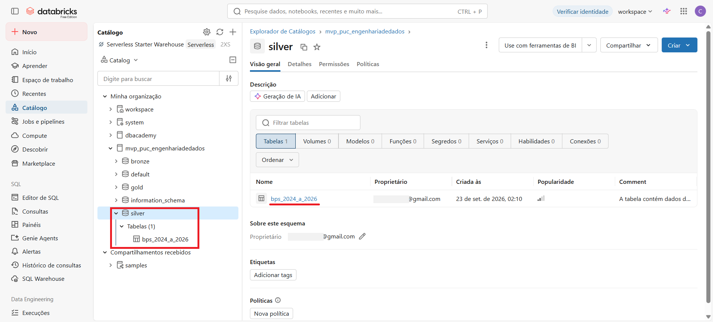  

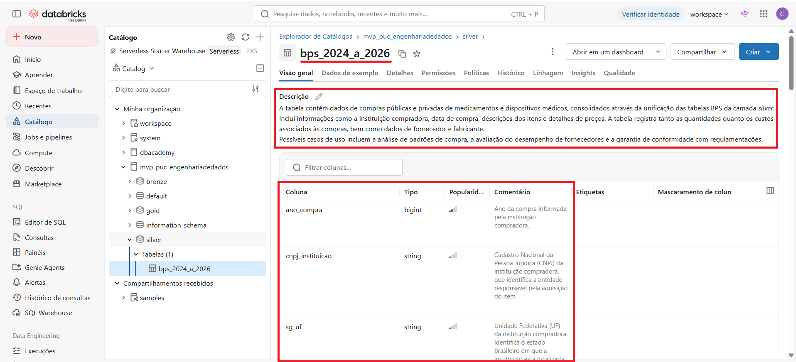

Através de comandos SQL `SELECT COUNT(*)` (vide _notebook_ "[_01_Carga de Dados](https://github.com/crisceia/mvp-puc-engenhariadedados/blob/main/Scripts%20e%20Resultados/_01_Carga%20de%20Dados.ipynb)"), verificamos que o total de registros em cada uma das tabelas anuais na camada _bronze_ corresponde à quantidade de registros da tabela unificada na camada _silver_, estratificada por ano do arquivo (campo de controle criado no momento da unificação).  

Sendo assim, avançamos para a etapa de análise acerca da qualidade dos dados, considerando os aspectos de completude, consistência, unicidade, acurácia e _outliers, tendo como objetivo avaliar a existência de registros que pudessem comprometer as análises de preços previstas no MVP.  

Todos os códigos e resultados referentes à esta etapa encontram-se no _notebook_ "[_02_Qualidade de Dados](https://github.com/crisceia/mvp-puc-engenhariadedados/blob/main/Scripts%20e%20Resultados/_02_Qualidade%20de%20Dados.ipynb)".  

A seguir, detalhamos cada uma das validações realizadas.

1. **Completude dos dados**  

- **Verificação de campos relevantes nulos**: Realizamos a análise sobre campos considerados relevantes para as análises e para a identificação dos registros. Dos 74.803 registros, não foram identificados valores nulos para `co_catmat`, `co_seq_bps`, `dt_compra`, `modalidade`, `vl_preco_unitario`, `vl_preco_total`, `qt_medicamento` ou para os CNPJs da instituição, fornecedor e fabricante. No entanto, identificamos 1.292 registros (1,73%) sem `dt_insercao` , 20 registros (0,03%) sem `un_medida_capacidade` e 20 registros (0,03%) sem `un_fornecimento`. 

   Verificamos que todos os 1.292 registros sem `dt_insercao` são de compras realizadas em 2024. Quanto à ausência de `un_medida_capacidade` e `un_fornecimento`, verificamos que elas ocorrem para os mesmos 12 CATMATs.  

   Contudo, a ausência desses atributos não compromete as principais análises previstas no MVP, uma vez que o preço unitário, o CATMAT e as demais informações necessárias às análises de preços permanecem preenchidos.  

2. **Consistência dos dados**  

- **Validação do período de referência**: Verificamos a data de compra registrada na base varia de 01/01/2024 a 17/09/2026, correspondendo ao período efetivamente disponível nos arquivos utilizados.  

- **Validação do ano do arquivo x ano da compra**: Verificamos que não há divergência entre o ano do arquivo e o ano da compra, isto é, o ano de referência informado na fonte dos dados corresponde ao ano informado pela pela instituição compradora no campo `ano_compra`.  

- **Validação do ano da compra x ano contido na data de compra**: Verificamos que não existem registros de compra que o ano da compra informado pela instituição compradora no campo `ano_compra` diverge do ano da compra contido no campo `dt_compra`.  

- **Validação de data de compra x data de inserção**: Verificamos que existem 11 registros em que `dt_insercao` antecede `dt_compra`, calculando também a diferença, em dias, entre as duas datas. Estes registros estão concentrados em duas instituições compradoras, com 7 e 4 registros, respectivamente. Como não foi possível determinar a causa dessa divergência a partir das informações disponíveis na fonte, os registros foram preservados e documentados, sem correção por inferência.  

- **Validação de preço unitário**: Verificamos que não existem registros de compra em que o preço unitário do item consta como zero ou valor negativo.  

- **Validação de quantidade de itens comprados**: Verificamos que não existem registros de compra em que a quantidade de itens comprados consta como zero ou valor negativo.  

- **Validação preço unitário x quantidade de itens x preço total**: Verificamos que não há divergência entre o `vl_preco_total` informado e o valor calculado a partir de `vl_preco_unitario` × `qt_medicamento`.  

- **Validação de UFs**: Verificamos que as UFs registradas na base correspondem ao domínio esperado de Unidades Federativas do Brasil.  

- **Validação do CNPJ da instituição, do fornecedor e do fabricante**: Foi criada a função `fn_valida_cnpj` de validação de CNPJ, considerando a quantidade de dígitos, a rejeição de sequências formadas por um único dígito e a validação dos dois dígitos verificadores. Em seguida, a função foi aplicada separadamente aos CNPJs das instituições, fornecedores e fabricantes, de modo que observamos que não há ocorrência de CNPJs inválidos na base.  

- **Verificação de CATMATs com múltiplas apresentações**: Verificamos a existência de diferentes valores para `un_fornecimento`, `vl_capacidade` e/ou `un_medida_capacidade` para 613 CATMATs. Esse resultado é relevante para a modelagem, pois demonstra que essas características não devem ser utilizadas isoladamente para definir a identidade do produto. Assim, o CATMAT foi mantido como identificador principal do item, enquanto unidade de fornecimento e características de capacidade são tratadas como atributos contextuais do registro de compra.  

3. **Unicidade dos dados**  

- **Validação de unicidade do código sequencial BPS**: Verificamos que não há duplicidades em relação ao `co_seq_bps`, utilizado como identificador sequencial do registro no BPS. Logo, concluímos que este identificador pode ser utilizado para rastrear individualmente os registros de compra na camada _silver_ e posteriormente na tabela fato.  

- **Verificação de registros aparentemente idênticos**: Realizamos uma análise complementar de registros aparentemente idênticos, considerando atributos como ano da compra, instituição, data, CATMAT, fornecedor, quantidade e preço unitário. Foram encontrados 488 conjuntos de registros com os mesmos valores nesses atributos. Entretanto, a existência dessas ocorrências não foi interpretada automaticamente como duplicidade, uma vez que o `co_seq_bps` permanece distinto. Com os dados disponíveis no escopo deste MVP, não é possível determinar se essas ocorrências correspondem a compras distintas ou a registros duplicados, sendo necessária uma investigação mais aprofundada junto à fonte dos dados para essa conclusão. Dessa forma, os registros foram preservados, evitando a exclusão indevida de compras potencialmente legítimas.  

4. **Acurácia e preservação dos dados**  

- **Verificação de campos críticos (camada _bronze_ x _silver_)**: Como não há, no escopo deste MVP, uma fonte externa que permita validar a veracidade dos valores informados pelas instituições, a avaliação de acurácia foi direcionada à preservação dos dados durante o processo de transformação da camada _bronze_ para a camada _silver_.  

   Foram comparados campos críticos dos registros de 2024, 2025 e 2026 entre as respectivas tabelas da camada _bronze_ e a tabela consolidada da camada _silver_, utilizando `co_seq_bps` para correspondência dos registros. Não foram identificadas divergências nos campos críticos analisados em nenhum dos três anos.

   Esse resultado indica que a consolidação dos arquivos não alterou os principais atributos utilizados nas análises, preservando os valores de CATMAT, instituição, fornecedor, data de compra, quantidade e preços.  

5. **_Outliers_**  

- **Identificação de itens com preço unitário potencialmente atípico**: A identificação foi realizada individualmente por CATMAT, utilizando o Intervalo Interquartil (IQR). O IQR é uma medida de dispersão que representa a diferença entre o terceiro quartil (Q3) e o primeiro quartil (Q1), abrangendo os 50% centrais dos dados. Sendo assim, foram considerados apenas CATMATs com pelo menos cinco registros com preço unitário válido, adotando esse limite como um critério operacional do MVP para dar maior estabilidade à comparação estatística.

   Os limites foram definidos por `Q1 − 1,5 × IQR` e `Q3 + 1,5 × IQR`. Os registros que ultrapassam esses limites foram classificados como potencialmente atípicos, sem exclusão ou alteração dos dados originais.

   Na base analisada, foram identificados 1.181 registros abaixo do limite inferior e 6.626 acima do limite superior. A predominância de registros acima do limite superior indica que a maior parte dos potenciais valores atípicos identificados pelo critério estatístico corresponde a preços unitários relativamente elevados em comparação com os demais registros do mesmo CATMAT.

   Essa identificação não significa que os registros representem erros, inconsistências ou irregularidades nas compras. Os valores foram mantidos na base e sinalizados para análise posterior, em alinhamento com o objetivo do MVP de investigar a dispersão dos preços e a distribuição dos registros potencialmente atípicos.  

**Conclusão quanto à qualidade dos dados**:  

De forma geral, as validações realizadas indicam que a base consolidada apresenta condições adequadas para as análises propostas no MVP. Os principais campos utilizados nas comparações de preços apresentam preenchimento completo, não foram identificados preços ou quantidades não positivos, não foram encontradas duplicidades no identificador sequencial BPS e não houve divergência nos campos críticos durante a consolidação da camada _bronze_ para a _silver_.  

Foram identificadas duas situações que devem ser consideradas na interpretação dos dados: a ausência de `dt_insercao` em uma parcela dos registros (1,73% - 1.292 de 74.803) e a existência de 11 registros cuja `dt_insercao` antecede `dt_compra`. Como não foi possível determinar a causa desses casos a partir da fonte disponível, os dados foram preservados e as ocorrências foram documentadas, em vez de serem corrigidas por meio de inferências.  

A análise de valores potencialmente atípicos também foi mantida como etapa de investigação, e não como mecanismo de exclusão de dados. Dessa forma, a camada _silver_ preserva os registros da fonte após sua consolidação e validação, enquanto a identificação e exploração dos potenciais valores atípicos são utilizadas nas análises da camada _gold_.  

### Camada _gold_  

A camada _gold_ corresponde à etapa de modelagem final do _pipeline_, construída a partir da tabela consolidada da camada _silver_. Enquanto a _silver_ teve como objetivo consolidar, validar e preservar os registros provenientes dos arquivos do BPS, a _gold_ organiza esses dados de forma estruturada para facilitar as análises de negócio definidas para o MVP. Essa abordagem está alinhada à Arquitetura Medalhão, na qual a camada _gold_ contém os dados modelados para consumo analítico.  

1. **Modelagem dos dados**  

A estrutura adotada foi o **Esquema Estrela** (_Star Schema_), composto por uma tabela fato central e dimensões relacionadas, conforme evidenciado na imagem abaixo, permitindo analisar os registros de compra sob diferentes perspectivas, como produto, instituição, fornecedor e tempo.  

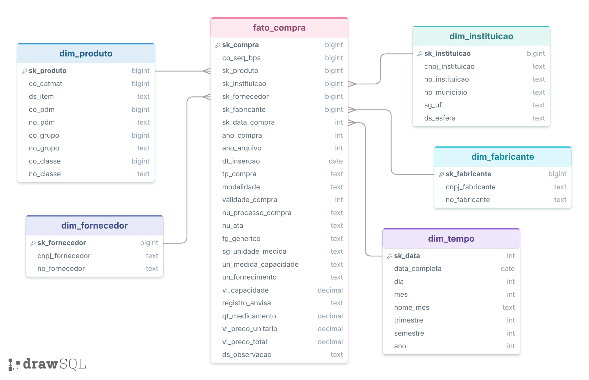

As decisões de modelagem foram orientadas pelos resultados obtidos na análise de qualidade da camada _silver_.  

Primeiro, a validação de unicidade demonstrou que o campo `co_seq_bps` não apresenta duplicidades, permitindo utilizá-lo para rastrear individualmente cada registro de compra na tabela fato. Ao mesmo tempo, foram identificados conjuntos de registros com atributos aparentemente idênticos, mas com `co_seq_bps` distintos. Como não foi possível determinar, no escopo do MVP, se essas ocorrências correspondem a compras distintas ou a duplicidades na origem, os registros foram preservados. Dessa forma, a tabela fato mantém a totalidade dos registros da _silver_, sem deduplicação por inferência.  

Na análise de CATMATs com múltiplas apresentações, foram identificados CATMATs associados a diferentes valores de unidade de fornecimento, capacidade e/ou unidade de medida de capacidade. Por esse motivo, essas características não foram utilizadas isoladamente para definir a identidade do produto. O `co_catmat` foi adotado como identificador principal do item na `dim_produto`, enquanto as características específicas da apresentação permanecem associadas ao registro da compra na tabela fato.  

Outra decisão decorrente da análise de qualidade foi a preservação dos valores nulos existentes em campos que não são essenciais para as principais análises, como `dt_insercao`, `un_medida_capacidade` e `un_fornecimento`. Como não foram identificados valores nulos nos principais campos utilizados para comparação de preços, como CATMAT, data da compra, preço unitário, quantidade e preço total, esses registros puderam ser incorporados à modelagem sem tratamentos adicionais.  

Ademais, a identificação de preços potencialmente atípicos também não resultou em exclusão de registros. Os dados originais permanecem na `fato_compra`, enquanto os critérios estatísticos utilizados para identificar potenciais atipicidades são aplicados posteriormente nas estruturas analíticas da _gold_. Dessa forma, a modelagem preserva os dados da fonte e separa o registro da compra da interpretação analítica realizada sobre seu preço.  

O modelo resultante é composto pelas tabelas:  
- **`dim_tempo`**: dimensão temporal utilizada para análises por data e ano;  
- **`dim_produto`**: dimensão dos itens identificados pelo CATMAT;  
- **`dim_instituicao`**: dimensão das instituições compradoras;  
- **`dim_fornecedor`**: dimensão dos fornecedores;  
- **`dim_fabricante`** : dimensão dos fabricantes;  
- **`fato_compra`**: tabela fato que registra as compras e seus respectivos preços, quantidades e características.  

2. **Processo de preparação e carga da camada _gold_**  

**NOTA:** Todos os códigos e resultados referentes à esta etapa encontram-se no _notebook_ "[_03_Preparação de Dados](https://github.com/crisceia/mvp-puc-engenhariadedados/blob/main/Scripts%20e%20Resultados/_03_Prepara%C3%A7%C3%A3o%20de%20Dados.ipynb)".  

A preparação da camada _gold_ foi realizada em etapas. Inicialmente, foram criadas as tabelas de dimensão. Em seguida, cada dimensão foi populada a partir da tabela consolidada na camada _silver_. Por fim, os registros da _silver_ foram relacionados às dimensões para composição da fato_compra.

Na `dim_tempo`, foi criada uma linha para cada data de compra distinta existente na _silver_. A chave substituta `sk_data` foi derivada da própria data no formato AAAAMMDD, permitindo o relacionamento entre a data da compra e seus atributos temporais, como dia, mês, trimestre, semestre e ano.

Na `dim_produto`, foi mantida uma única linha por `co_catmat`. Como um mesmo CATMAT pode aparecer em diversos registros de compra, foi selecionado para a dimensão um registro representativo, utilizando como critério de ordenação a data da compra mais recente, seguida da data de inserção e do `co_seq_bps`. A totalidade dos registros de compra permanece na `fato_compra`.

A mesma lógica de seleção de um registro representativo foi aplicada às dimensões de instituição, fornecedor e fabricante, utilizando os respectivos CNPJs como identificadores naturais e o registro mais recente como referência para os atributos descritivos.

Por fim, a `fato_compra` foi carregada a partir da _silver_ por meio do relacionamento dos registros com as dimensões, substituindo os identificadores naturais pelos respectivos identificadores das dimensões (`sk_produto`, `sk_instituicao`, `sk_fornecedor`, `sk_fabricante` e `sk_data_compra`). O `co_seq_bps` original foi preservado na fato para permitir a rastreabilidade do registro até a fonte.

3. **Estruturas analíticas para as perguntas de negócio**  

Além das tabelas fato e dimensão, foram criadas duas _views_ na camada _gold_ para apoiar diretamente as análises (vide "[_03_Preparação de Dados](https://github.com/crisceia/mvp-puc-engenhariadedados/blob/main/Scripts%20e%20Resultados/_03_Prepara%C3%A7%C3%A3o%20de%20Dados.ipynb)").  

A `vw_registros_elegiveis` reúne os registros com preço unitário preenchido e positivo associados a CATMATs que possuem pelo menos cinco registros válidos. O limite de cinco observações foi adotado como **critério operacional deste MVP**, buscando maior estabilidade para as comparações estatísticas, e não como uma regra universal para identificação de valores atípicos.  

Essa _view_ concentra os atributos necessários para as análises de dispersão e comparação de preços, relacionando informações da fato com as dimensões de produto, tempo, instituição e fornecedor.  

A `vw_potenciais_outliers` utiliza os registros elegíveis para calcular, individualmente por CATMAT, o primeiro e o terceiro quartis, o Intervalo Interquartil (IQR) e os limites inferior e superior definidos por `Q1 − 1,5 × IQR` e `Q3 + 1,5 × IQR`. Os registros que ultrapassam esses limites são sinalizados como potencialmente atípicos, sem alteração ou exclusão dos dados originais.  

Essa estrutura permite que a análise de potenciais valores atípicos seja realizada sobre o preço de cada compra em relação aos demais registros do mesmo CATMAT, mantendo disponíveis as dimensões de tempo, instituição, modalidade, tipo de compra e fornecedor para as análises posteriores.  

4. **Validação da modelagem**  

Após a carga da camada _gold_, foram realizadas validações para verificar a integridade dos relacionamentos entre a tabela fato e as dimensões. Foram verificadas a quantidade de registros da fato, a existência de chaves estrangeiras sem correspondência nas dimensões e a associação dos registros aos produtos e datas correspondentes. (vide "[_03_Preparação de Dados](https://github.com/crisceia/mvp-puc-engenhariadedados/blob/main/Scripts%20e%20Resultados/_03_Prepara%C3%A7%C3%A3o%20de%20Dados.ipynb)")  

Com isso, a camada _gold_ estabelece uma estrutura única para responder às perguntas de negócio do MVP: a `fato_compra` preserva o nível detalhado das aquisições, enquanto as dimensões permitem analisar os preços segundo produto, tempo, instituição, fornecedor e fabricante. As _views_ analíticas acrescentam a seleção dos registros elegíveis e a identificação dos preços potencialmente atípicos, preparando os dados para a etapa seguinte, de análise dos resultados.  

5. **Catálogo de dados**  

O catálogo de dados documenta as tabelas, suas colunas, tipos e respectivas finalidades analíticas. As descrições dos campos relacionados ao BPS foram baseadas no dicionário de dados e metadados disponibilizado pelo Ministério da Saúde.  

A descrição da tabela, bem como dos respectivos campos, foi realizada via interface "Catálogo" no Databricks.  

Abaixo, seguem evidências das tabelas criadas na camada _gold_, bem como amostra do catálogo de dados da tabela `fato_compra`. Para visualização completa do catálogo de dados desta tabela e das demais tabelas e _views_ da camada _gold_, consultar o _notebook_ "[_05_Anexos_Catálogo de Dados](https://github.com/crisceia/mvp-puc-engenhariadedados/blob/main/Scripts%20e%20Resultados/_05_Anexos_Cat%C3%A1logo%20de%20Dados.ipynb)".  

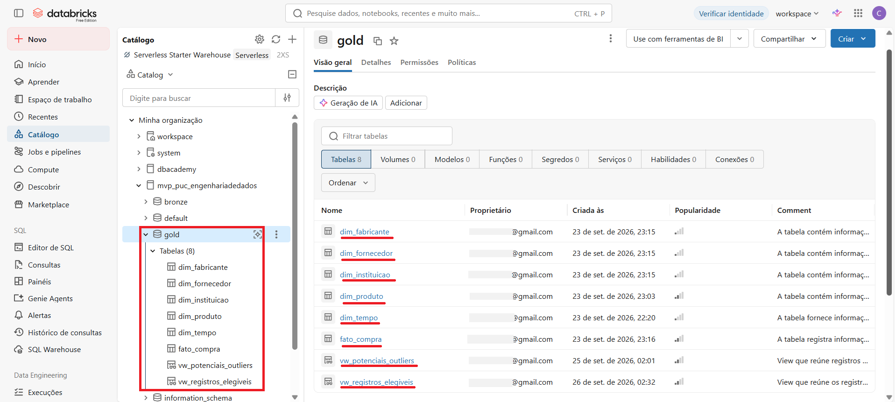

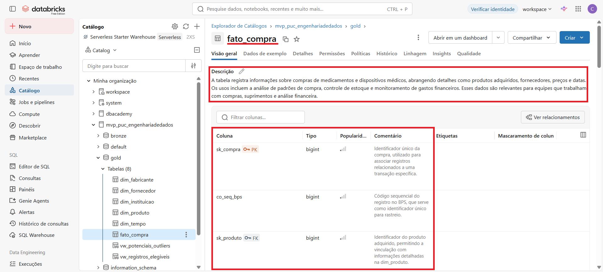

## Análise dos Dados  
---   
A análise dos dados foi realizada sobre a camada _gold_, utilizando a `fato_compra`, as dimensões do modelo e as _views_ analíticas `vw_registros_elegiveis` e `vw_potenciais_outliers`. As consultas e as respectivas saídas constam no _notebook_ "[_04_Análise de Dados](url)".

Para as análises de preço, foram considerados registros com `vl_preco_unitario` preenchido e positivo e associados a CATMATs com pelo menos cinco registros válidos, conforme critério operacional definido para este MVP. A identificação de preços potencialmente atípicos foi realizada individualmente por CATMAT, utilizando o Intervalo Interquartil (IQR), conforme descrito na etapa de preparação da camada _gold_.  

Abaixo, seguem o detalhamento das análises realizadas e respostas às perguntas de negócio previamente definidas.  

#### P1. Como evoluíram os preços unitários registrados no BPS entre 2024 e 2026?  

Para avaliar a evolução dos preços unitários anualmente, foram calculados, por ano de compra, a quantidade de registros, a quantidade de CATMATs, o preço médio, a mediana e os primeiro e terceiro quartis.  

Os resultados mostram que o preço médio foi de **R$ 684,77 em 2024**, **R$ 288,82 em 2025** e **R$ 256,12 em 2026**. A mediana apresentou comportamento diferente, passando de **R$ 1,86 em 2024** para **R$ 2,11 em 2025** e **R$ 1,88 em 2026**.  

A diferença entre média e mediana é relevante para a interpretação dos resultados. A média é influenciada por valores extremos, enquanto a mediana representa o valor central das observações e, neste conjunto de dados, apresenta maior estabilidade entre os anos. Assim, a redução observada no preço médio não deve ser interpretada isoladamente como redução geral dos preços registrados no BPS.  

Os quartis também apresentam valores próximos entre os anos: o primeiro quartil variou de **R$ 0,32 a R$ 0,38**, enquanto o terceiro quartil variou de **R$ 7,41 a R$ 8,24**. Dessa forma, a distribuição central dos preços apresentou variação relativamente menor do que a observada no preço médio.  

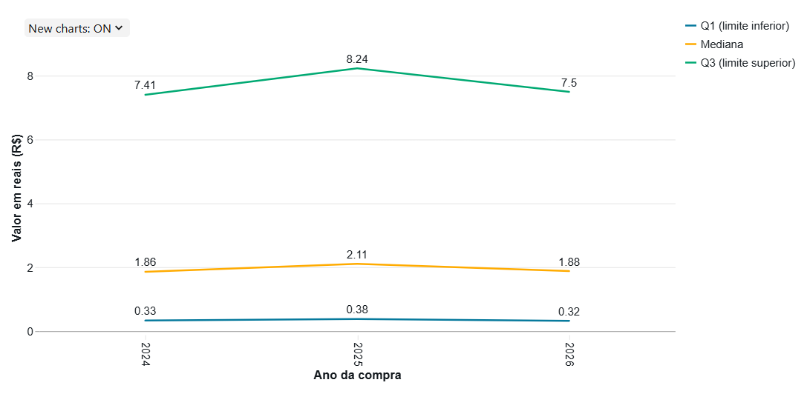

| Ano  |      Q1 | Mediana |      Q3 |
| ---- | ------: | ------: | ------: |
| 2024 | R$ 0,32 | R$ 1,86 | R$ 8,24 |
| 2025 | R$ 0,35 | R$ 2,11 | R$ 7,41 |
| 2026 | R$ 0,38 | R$ 1,88 | R$ 7,50 |  

#### P2. Quais itens (CATMATs) apresentam maior dispersão de preços no período?  

Para identificação dos CATMATs com maior dispersão de preços, foram utilizadas duas medidas complementares: o Intervalo Interquartil (IQR), que representa a dispersão entre o primeiro e o terceiro quartis, e o Coeficiente de Variação (CV), que relaciona o desvio-padrão à média.  

Pelo IQR, os maiores valores foram observados em CATMATs como **458500 - ALECTINIBE**, com IQR de **R$ 35.953,93**, **480036 - ISATUXIMABE**, com IQR de **R$ 10.881,80**, e **400563 - USTEQUINUMABE**, com IQR de **R$ 10.695,64**.  

Já o Coeficiente de Variação apresentou valores muito elevados em alguns CATMATs. Por exemplo, o CATMAT **271089 - AMOXICILINA** apresentou CV de **1.472,61%**, enquanto o **267517 - ATENOLOL** apresentou **1.191,81%**.  

As duas medidas possuem interpretações diferentes e, portanto, não devem ser utilizadas para estabelecer uma única classificação de dispersão. O IQR expressa a dispersão absoluta da faixa central dos preços, enquanto o CV permite avaliar a dispersão relativa à média. Além disso, a presença de valores extremos pode elevar significativamente o CV, especialmente quando os preços centrais são baixos.  

Dessa forma, os resultados indicam a existência de CATMATs com grande diversidade de preços, mas a interpretação deve considerar simultaneamente a medida de dispersão utilizada, a quantidade de registros e a presença de valores extremos. 

Lista dos 10 CATMATs que apresentam maior dispersão no período, pelo IQR:  

| CATMAT | Descrição do CATMAT                                                             | Qtd. Compras |           Q1 |      Mediana |           Q3 |          IQR |
| ------ | ------------------------------------------------------------------------------- | -----------: | -----------: | -----------: | -----------: | -----------: |
| 458500 | ALECTINIBE, CONCENTRAÇÃO:150 MG                                                 |            5 |    R$ 105,54 |    R$ 105,67 | R$ 36.059,47 | R$ 35.953,93 |
| 480036 | ISATUXIMABE, CONCENTRAÇÃO:20 MG/ML, FORMA FARMACÊUTICA:INJETÁVEL                |            6 |  R$ 2.678,34 |  R$ 2.712,03 | R$ 13.560,14 | R$ 10.881,80 |
| 400563 | USTEQUINUMABE, CONCENTRAÇÃO:90 MG/ML, FORMA FARMACÊUTICA:SOLUÇÃO INJETÁVEL      |           17 | R$ 11.204,36 | R$ 20.690,00 | R$ 21.900,00 | R$ 10.695,64 |
| 455395 | USTEQUINUMABE, CONCENTRAÇÃO:5 MG/ML, FORMA FARMACÊUTICA:SOLUÇÃO INJETÁVEL       |           12 | R$ 21.840,84 | R$ 26.314,26 | R$ 27.127,00 |  R$ 5.286,16 |
| 441461 | DARATUMUMABE, CONCENTRAÇÃO:20 MG/ML, FORMA FARMACÊUTICA:SOLUÇÃO INJETÁVEL       |           11 |  R$ 1.598,90 |  R$ 6.395,61 |  R$ 6.395,64 |  R$ 4.796,74 |
| 436778 | NIVOLUMABE, CONCENTRAÇÃO:10 MG/ML, FORMA FARMACÊUTICA:SOLUÇÃO INJETÁVEL         |           20 |  R$ 2.841,16 |  R$ 7.102,91 |  R$ 7.287,58 |  R$ 4.446,42 |
| 412718 | ICATIBANTO ACETATO, CONCENTRAÇÃO:10 MG/ML, FORMA FARMACÊUTICA:SOLUÇÃO INJETÁVEL |            8 |  R$ 3.030,00 |  R$ 4.953,60 |  R$ 6.882,32 |  R$ 3.852,32 |
| 357119 | BETA-AGALSIDASE, CONCENTRAÇÃO:35 MG, FORMA FARMACÊUTICA:PÓ LIÓFILO P/ INJETÁVEL |           11 | R$ 13.358,56 | R$ 13.961,27 | R$ 17.023,78 |  R$ 3.665,22 |
| 390008 | CETUXIMABE, CONCENTRAÇAO:5 MG/ML, FORMA FARMACEUTICA:SOLUÇÃO INJETÁVEL          |           10 |    R$ 813,12 |    R$ 813,12 |  R$ 4.065,58 |  R$ 3.252,46 |
| 290058 | ADALIMUMABE, CONCENTRAÇÃO:40 MG, APRESENTAÇÃO:SOLUÇÃO INJETÁVEL                 |           17 |    R$ 490,60 |  R$ 1.035,52 |  R$ 3.533,00 |  R$ 3.042,40 |

Lista dos 10 CATMATs que apresentam maior dispersão no período, pelo CV:  

| CATMAT | Descrição do CATMAT                                                | Qtd. Compras | Preço Médio | Desvio Padrão |       CV |
| ------ | ------------------------------------------------------------------ | -----------: | ----------: | ------------: | -------: |
| 271089 | AMOXICILINA, CONCENTRAÇÃO:500MG                                    |          224 |   R$ 231,57 |   R$ 3.410,08 | 1472,61% |
| 267517 | ATENOLOL, DOSAGEM:50 MG                                            |          190 |     R$ 0,55 |       R$ 6,53 | 1191,81% |
| 268252 | DIPIRONA SÓDICA, DOSAGEM:500 MG/ML, APRESENTAÇÃO:SOLUÇÃO INJETÁVEL |          176 |     R$ 6,69 |      R$ 77,58 | 1159,83% |
| 267741 | PREDNISONA, DOSAGEM:5 MG                                           |          160 |     R$ 1,43 |      R$ 16,60 | 1157,61% |
| 268856 | LOSARTANA POTÁSSICA, DOSAGEM:50 MG                                 |          185 |     R$ 0,68 |       R$ 7,72 | 1137,30% |
| 383750 | LACTULOSE, CONCENTRAÇÃO:667 MG/ML, FORMA FARMACEUTICA:XAROPE       |          134 |    R$ 91,44 |     R$ 995,15 | 1088,33% |
| 267743 | PREDNISONA, DOSAGEM:20 MG                                          |          170 |     R$ 8,24 |      R$ 89,34 | 1083,69% |
| 267613 | CAPTOPRIL, CONCENTRAÇÃO:25 MG                                      |          121 |     R$ 0,44 |       R$ 4,36 |  995,56% |
| 270119 | CLONAZEPAM, DOSAGEM:2 MG                                           |          205 |     R$ 0,63 |       R$ 6,27 |  988,08% |
| 268255 | EPINEFRINA, DOSAGEM:1MG/ML, USO:SOLUÇÃO INJETÁVEL                  |          156 |     R$ 8,90 |      R$ 87,66 |  984,57% |  

#### P3. Quais compras apresentam preços potencialmente atípicos em relação às demais compras do mesmo CATMAT?  

Para indicação de registros potencialmente atípicos, a `vw_potenciais_outliers` foi utilizada para identificar os registros cujo preço unitário está abaixo do limite inferior ou acima do limite superior calculado pelo método do Intervalo Interquartil (IQR). Assim, foram identificados **7.807 registros potencialmente atípicos**, sendo **1.181 (15,13%) abaixo do limite inferior** e **6.626 (84,87%) acima do limite superior**.  

A predominância de registros acima do limite superior indica que, entre os potenciais valores atípicos identificados, a maior parte corresponde a preços unitários relativamente elevados em comparação com as demais compras do mesmo CATMAT. Esse resultado é consistente com a assimetria observada na distribuição dos preços e complementa a análise de dispersão realizada na pergunta anterior.  

A identificação de um registro como potencialmente atípico não significa que a compra seja irregular, que o preço esteja incorreto ou que exista erro na fonte. O resultado indica apenas que, segundo o critério estatístico adotado, aquele preço se encontra fora da faixa definida a partir dos demais registros do mesmo CATMAT.  

Para permitir a investigação dos registros identificados, a análise apresenta, para cada ocorrência, o CATMAT, a descrição do item, o preço unitário, os limites estatísticos utilizados, o tipo de atipicidade e informações de contexto da compra, como ano, instituição, fornecedor, tipo e modalidade de compra.  

| Classificação                     | Quantidade |  Percentual |
| --------------------------------- | ---------: | ----------: |
| Acima do limite superior          |      6.626 |      84,87% |
| Abaixo do limite inferior         |      1.181 |      15,13% |
| **Total potencialmente atípicos** |  **7.807** | **100,00%** |  

Amostra contendo 10 registros potencialmente atípicos, priorizando aqueles com maior distância em relação ao limite estatístico:  

| Registro BPS | Ano | CATMAT | Descrição do CATMAT | Preço Unitário | Limite Inferior | Limite Superior | Distância do Limite | Tipo de Atipicidade |
|---:|---:|---:|---|---:|---:|---:|---:|---|
| 17628923 | 2024 | 606824 | TEZEPELUMABE, CONCENTRAÇÃO:110 MG/ML, FORMA FARMACÊUTICA\:SOLUÇÃO INJETÁVEL, CARACTERÍSTICAS ADICIONAIS\:SERINGA PREENCHIDA | R$ 8.191.720,00 | R$ 7.480,74 | R$ 8.147,34 | R$ 8.183.572,66 | Acima do limite superior |
| 17664330 | 2026 | 270895 | CARBONATO DE CÁLCIO, DOSAGEM:500MG DE CÁLCIO | R$ 1.149.000,00 | -R$ 0,73 | R$ 1,37 | R$ 1.148.998,63 | Acima do limite superior |
| 17830908 | 2025 | 305725 | OCTREOTIDA, DOSAGEM:0,1 MG/ML, FORMA FARMACÊUTICA\:SOLUÇÃO INJETÁVEL | R$ 520.000,00 | -R$ 5,64 | R$ 147,22 | R$ 519.852,78 | Acima do limite superior |
| 17709621 | 2024 | 439214 | CUBA USO HOSPITALAR, MATERIAL\:AÇO INOX, FORMATO\:TIPO RIM, CAPACIDADE\:CERCA DE 700 ML | R$ 362.750,00 | R$ 0,15 | R$ 124,07 | R$ 362.625,93 | Acima do limite superior |
| 17710588 | 2025 | 272815 | PENICILAMINA, DOSAGEM:250 MG | R$ 294.400,00 | R$ 27,59 | R$ 30,55 | R$ 294.369,45 | Acima do limite superior |
| 17611652 | 2024 | 439259 | AXITINIBE, CONCENTRAÇÃO:5 MG | R$ 253.090,00 | R$ 172,80 | R$ 386,92 | R$ 252.703,08 | Acima do limite superior |
| 17630416 | 2024 | 437552 | CANETA ALTA ROTAÇÃO, MATERIAL ROLAMENTO\:ROLAMENTO CERÂMICA, VELOCIDADE MÁXIMA\:VELOCIDADE MÁXIMA MENOR OU IGUAL 400.000 RPM, REFRIGERAÇÃO:3 OU MAIS FUROS, TROCA DE BROCAS\:BOTÃO DE PRESSÃO(PB), TIPO CONEXÃO\:CONEXÃO 2 FUROS, TIPO CABEÇA\:CABEÇA PADRÃO | R$ 249.990,00 | -R$ 49,97 | R$ 669,95 | R$ 249.320,05 | Acima do limite superior |
| 17680365 | 2024 | 433445 | ACESSÓRIO BOMBA INSULINA, TIPO ACESSÓRIO\:RESERVATÓRIO, MATERIAL\:POLIPROPILENO TRANSPARENTE, COMPONENTE\:TIPO SERINGA CERCA 3 ML | R$ 202.000,00 | -R$ 1.548,00 | R$ 3.488,80 | R$ 198.511,20 | Acima do limite superior |
| 17724757 | 2025 | 356051 | ÁCIDO ZOLEDRÔNICO, CONCENTRAÇÃO:50 MCG/ML, FORMA FARMACEUTICA\:SOLUÇÃO INJETÁVEL | R$ 199.000,00 | -R$ 135,23 | R$ 801,14 | R$ 198.198,86 | Acima do limite superior |
| 17638698 | 2025 | 480015 | ROMOSOZUMABE, CONCENTRAÇÃO:90 MG/ML, FORMA FARMACÊUTICA\:SOLUÇÃO INJETÁVEL, ADICIONAL\:SERINGA PREENCHIDA | R$ 161.765,00 | -R$ 342,66 | R$ 2.848,43 | R$ 158.916,57 | Acima do limite superior |

**NOTA**: O limite inferior calculado pelo método do IQR pode assumir valores negativos em alguns CATMATs. Como os preços unitários são valores não negativos, nesses casos não há registros classificados como potencialmente atípicos abaixo do limite inferior. O valor negativo é mantido como resultado do cálculo estatístico, sem substituição por zero.  

#### P4a. Como os registros potencialmente atípicos em relação às demais compras do mesmo CATMAT se distribuem ao longo do tempo, por ano?  

Após a identificação dos registros potencialmente atípicos, foi analisada sua distribuição por ano de compra, sendo:

| Ano  | Elegíveis | Potencialmente atípicos |      % |
| ---- | --------: | ----------------------: | -----: |
| 2024 |    26.071 |                   3.179 | 12,19% |
| 2025 |    30.563 |                   3.585 | 11,73% |
| 2026 |    10.178 |                   1.043 | 10,25% |

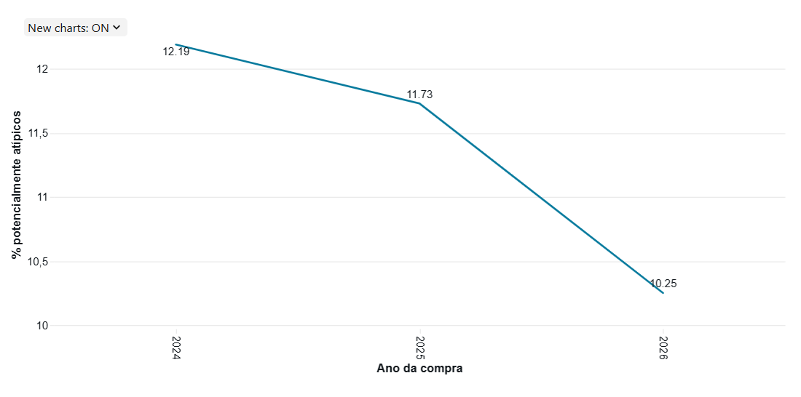

Os resultados indicam uma redução gradual do percentual de registros potencialmente atípicos ao longo do período analisado. Em todos os anos, entretanto, os registros acima do limite superior representam a maior parcela dos potenciais valores atípicos.  

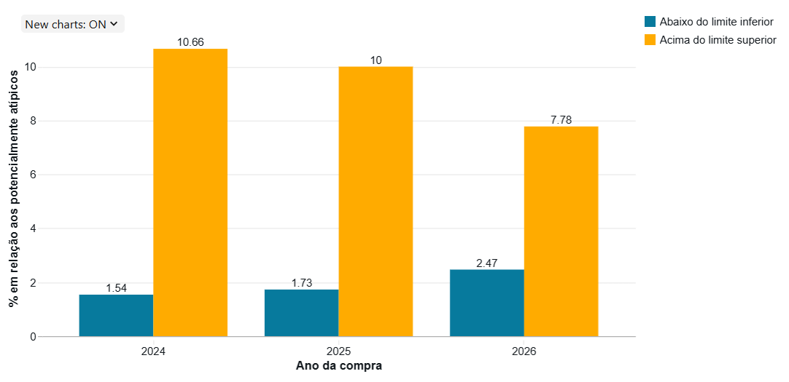

Essa comparação deve considerar que o arquivo de 2026 contém dados até **17/09/2026**, não representando um ano completo.

#### P4b. Como os registros potencialmente atípicos em relação às demais compras do mesmo CATMAT se distribuem por tipo de compra?  

Após a identificação dos registros potencialmente atípicos, foi analisada sua distribuição por ano de compra, sendo:  

| Tipo de compra  | Elegíveis | Potencialmente atípicos |      % |
| --------------- | --------: | ----------------------: | -----: |
| JUDICIAL        |     4.832 |                     971 | 20,10% |
| ADMINISTRATIVA  |    61.980 |                   6.836 | 11,03% |

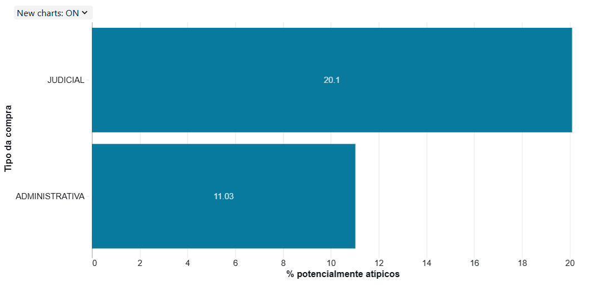

Portanto, a proporção de registros potencialmente atípicos foi maior entre os registros classificados como judiciais. Em ambos os tipos de compra, entretanto, predominam os registros acima do limite superior.  

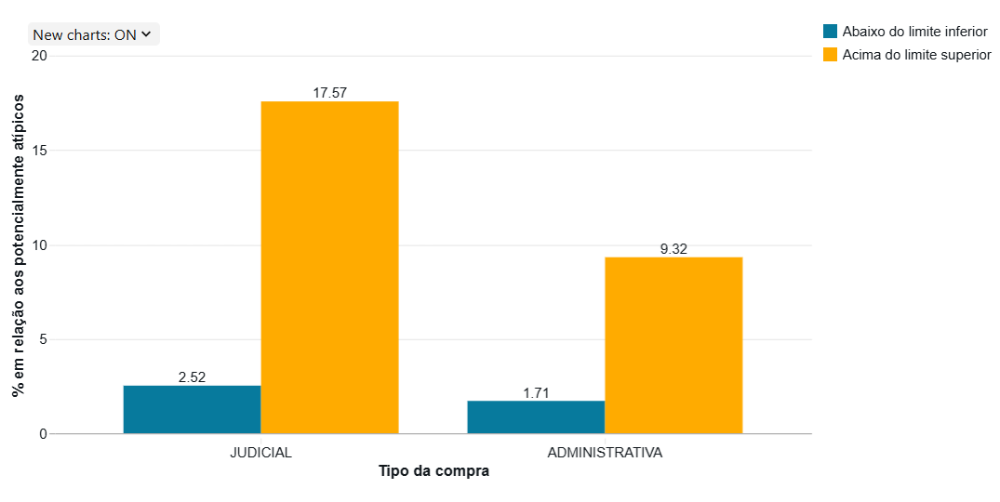

Esse resultado representa uma diferença na distribuição dos registros potencialmente atípicos entre os dois tipos de compra e não permite, isoladamente, estabelecer uma relação causal entre o tipo de compra e o preço.  

#### 4c. Como os registros potencialmente atípicos em relação às demais compras do mesmo CATMAT se distribuem por modalidade de compra?

A análise por modalidade apresentou diferenças na proporção de registros potencialmente atípicos. Como critério operacional deste MVP, modalidades com **menos de 100 registros elegíveis** foram classificadas como de baixa representatividade, enquanto modalidades com 100 ou mais registros elegíveis foram consideradas de **representatividade adequada** para a análise.  

Entre as modalidades com representatividade adequada, a **Dispensa de Licitação** apresentou 638 potenciais atípicos em 2.413 registros elegíveis (**26,44%**), o **Pregão** apresentou 6.059 em 53.199 (**11,39%**) e o **Registro de Preços** apresentou 1.105 em 11.142 (**9,92%**).  

As demais modalidades possuem menos de 100 registros elegíveis e, por esse motivo, foram classificadas como de baixa representatividade. A modalidade **Concorrência**, por exemplo, possui apenas um registro e esse registro foi classificado como potencialmente atípico, resultando em percentual de 100%. Esse percentual não deve ser interpretado da mesma forma que os percentuais observados em modalidades com milhares de registros.  

|           Modalidade         | Elegíveis | Representatividade | Potencialmente atípicos |    %    |
|------------------------------|----------:|--------------------|------------------------:|--------:|
| Concorrência                 |         1 | Baixa              |                       1 | 100,00% |
| Dispensa de Licitação        |     2.413 | Adequada           |                     638 |  26,44% |
| Pregão                       |    53.199 | Adequada           |                   6.059 |  11,39% |
| Inexigibilidade de Licitação |        19 | Baixa              |                       2 |  10,53% |
| Concurso                     |        10 | Baixa              |                       1 |  10,00% |
| Registro de Preços           |    11.142 | Adequada           |                   1.105 |   9,92% |
| Leilão                       |        27 | Baixa              |                       1 |   3,70% |
| Diálogo Competitivo          |         1 | Baixa              |                       0 |   0,00% |

#### P4d. Como os registros potencialmente atípicos em relação às demais compras do mesmo CATMAT se distribuem por fornecedor, entre aqueles com volume financeiro relevante?   

Para esta análise, foram adotados **dois critérios operacionais arbitrários** para restringir o universo de fornecedores analisados. O primeiro foi um valor mínimo de **R$ 1 milhão em vendas elegíveis**, utilizado para selecionar fornecedores com volume financeiro relevante. O segundo foi uma **quantidade mínima de registros elegíveis**, utilizada para evitar a interpretação de percentuais calculados sobre um número muito reduzido de observações.  

Os dois critérios têm finalidades distintas e são aplicados de forma complementar: o valor mínimo de vendas considera a **relevância financeira** do fornecedor, enquanto a quantidade mínima de registros considera a **representatividade da quantidade de observações** utilizada no cálculo do percentual de registros potencialmente atípicos. Eles devem ser interpretados como decisões metodológicas específicas deste MVP, e não como limites estatísticos universais.  

A análise considera, para os fornecedores que atendem aos critérios estabelecidos, a quantidade de registros elegíveis, o valor total das vendas elegíveis, a quantidade de registros potencialmente atípicos e o percentual de registros potencialmente atípicos.  

Os resultados permitem identificar fornecedores que apresentam maior concentração de registros classificados como potencialmente atípicos dentro do seu próprio conjunto de vendas elegíveis. Essa concentração não significa, por si só, que o fornecedor pratique preços inadequados ou que existam irregularidades nas compras. O resultado deve ser interpretado como um mecanismo de direcionamento para investigação dos registros identificados.  

Amostra contendo 10 fornecedores com maior percentual de registros potencialmente atípicos:  

| Fornecedor                                                                                           | Elegíveis | Representatividade | Valor Total das Vendas Elegíveis | Potencialmente Atípicos | % Potencialmente Atípicos | % Abaixo do Limite | % Acima do Limite |
| ---------------------------------------------------------------------------------------------------- | --------: | ------------------ | -------------------------------: | ----------------------: | ------------------------: | -----------------: | ----------------: |
| FARMAGUEDES COMERCIO DE PRODUTOS FARMACEUTICOS, MEDICOS E HOSPITALARES LTDA                          |       168 | Adequada           |                  R$ 1.252.238,50 |                     144 |                    85,71% |              0,00% |            85,71% |
| SAO MARCOS DISTRIBUIDORA DE MEDICAMENTOS, EQUIPAMENTOS E MATERIAIS HOSPITALARES E ODONTOLOGICOS LTDA |       626 | Adequada           |                  R$ 2.555.835,83 |                     533 |                    85,14% |              0,00% |            85,14% |
| PRADO PHARMA LTDA                                                                                    |       185 | Adequada           |                  R$ 2.338.821,16 |                     153 |                    82,70% |              0,00% |            82,70% |
| DISPROFARMA COMERCIO LTDA                                                                            |       133 | Adequada           |                  R$ 1.847.658,50 |                      97 |                    72,93% |              0,00% |            72,93% |
| PROHOSPITAL COMERCIO HOLANDA LTDA                                                                    |       112 | Adequada           |                  R$ 1.154.590,54 |                      69 |                    61,61% |              1,79% |            59,82% |
| PARAMED DISTRIBUIDORA DE MEDICAMENTOS LTDA                                                           |       667 | Adequada           |                  R$ 1.800.478,89 |                     286 |                    42,88% |             16,79% |            26,09% |
| KASMEDI DISTRIBUIDORA DE MEDICAMENTOS LTDA                                                           |       152 | Adequada           |                  R$ 2.129.669,45 |                      56 |                    36,84% |              0,66% |            36,18% |
| REALMED DISTRIBUIDORA LTDA                                                                           |       171 | Adequada           |                  R$ 5.288.840,41 |                      53 |                    30,99% |              0,00% |            30,99% |
| ALAGOAS COMERCIAL MEDICA LTDA                                                                        |       192 | Adequada           |                  R$ 1.244.511,80 |                      55 |                    28,65% |             17,71% |            10,94% |
| SAFRAMED HOSPITALAR LTDA                                                                             |       136 | Adequada           |                  R$ 1.791.454,48 |                      34 |                    25,00% |              2,21% |            22,79% |

#### Síntese dos resultados

As análises realizadas mostram que os preços registrados no BPS apresentam elevada variedade entre compras de um mesmo CATMAT. Essa característica é observada tanto nas medidas de dispersão quanto na identificação de registros potencialmente atípicos.  

A comparação anual indica que a mediana dos preços permaneceu relativamente estável entre 2024 e 2026, enquanto o preço médio apresentou valores significativamente superiores, especialmente em 2024, evidenciando a influência de valores extremos sobre essa medida.  

A análise pelo IQR identificou CATMATs com ampla dispersão de preços e a aplicação desse critério permitiu sinalizar registros cujo preço se encontra fora da faixa esperada em relação às demais compras do mesmo item. A predominância de registros acima do limite superior também foi observada nas análises por ano, tipo e modalidade de compra.  

As análises por tipo, modalidade e fornecedor acrescentam diferentes perspectivas para a investigação dos registros potencialmente atípicos. Dessa forma, o MVP permite transformar os registros do BPS em uma estrutura analítica capaz de comparar preços entre compras do mesmo CATMAT, identificar padrões de dispersão e sinalizar registros potencialmente atípicos para investigação posterior, preservando os dados originais e evitando a interpretação automática desses registros como erros ou irregularidades.  

## Autoavaliação
---  
Considero que os objetivos definidos para este MVP foram alcançados. O projeto permitiu construir um _pipeline_ de dados em arquitetura de camadas _bronze_, _silver_ e _gold_, aplicar etapas de tratamento e validação da qualidade dos dados e estruturar um modelo dimensional para análise dos registros do Banco de Preços em Saúde. A partir dessa estrutura, foi possível desenvolver consultas analíticas voltadas à evolução dos preços, à dispersão dos preços por CATMAT e à identificação e distribuição de registros potencialmente atípicos.  

A escolha do tema também foi um fator de motivação para a realização do projeto. A análise de preços, a identificação de exceções e a investigação de possíveis situações que merecem atenção possuem alguma similaridade com atividades que já realizei no contexto de Auditoria Interna, embora o objetivo e a abordagem sejam diferentes neste projeto. Além disso, foi interessante e importante ter um primeiro contato com a plataforma Databricks.  

A principal dificuldade encontrada foi conciliar a necessidade de aprofundar as análises com a proposta de manter o projeto como um MVP. Foi necessário tomar decisões sobre quais transformações, validações, estruturas e perguntas seriam suficientes para demonstrar os conceitos trabalhados nas disciplinas sem tornar a solução excessivamente complexa, considerando também o prazo disponível.  

Como trabalhos futuros, o projeto poderia ser ampliado com a inclusão de novas fontes de dados e variáveis que permitissem contextualizar melhor as diferenças de preços, além do aprofundamento das análises de qualidade e das regras de identificação de registros potencialmente atípicos. Também seria possível desenvolver novas análises sobre fornecedores, instituições, categorias de produtos e evolução temporal, bem como automatizar de forma mais completa a ingestão dos arquivos e a atualização das camadas do _pipeline_.

## Referências
---
1. **Banco de Preços em Saúde (BPS)**. Acesso à informação disponibilizada pelo Ministério da Saúde, em https://www.gov.br/saude/pt-br/acesso-a-informacao/banco-de-precos.  
2. **Passo-a-passo do BPS - Consulta de códigos BR no BPS**. Introdução ao BPS e nomenclatura de medicamentos e dispositivos médicos, disponibilizado entre os treinamentos de BPS pelo Ministério da Saúde, em https://www.gov.br/saude/pt-br/acesso-a-informacao/gestao-do-sus/economia-da-saude/banco-de-precos-em-saude/treinamentos/arquivos/4PassoapassoparaconsultadecdigoBR.pdf.  
3. **Dados e Recursos do BPS**. Origem dos dados e dicionário de dados disponilizado no Portal de Dados Abertos do SUS, em https://dadosabertos.saude.gov.br/dataset/bps.  
4. **_What is Medallion Architecture?_**. Padrão de organização de dados adotado no Databricks, em camadas progressivas quanto à estrutura e à qualidade dos dados. Disponível em https://www.databricks.com/blog/what-is-medallion-architecture.  
5. **_What are outliers in the data?_**. _National Institute of Standards and Technology_ (NIST). Seção 7.1.6 do _Engineering Statistics Handbook_, disponível em https://www.itl.nist.gov/div898/handbook/prc/section1/prc16.htm.  
6. **_DrawSQL_**. Ferramenta utilizada para representação do modelo de dados, acessível em https://drawsql.app/.  